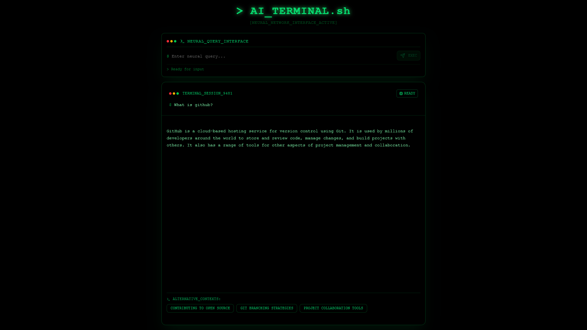

# LLM Cards




## Swipe-Based AI Interface for Smart Exploration

LLM Cards is an innovative AI interface that transforms how you interact with language models. Instead of traditional chat interfaces, you get instant access to multiple AI perspectives through intuitive swipe gestures.

**Created by [@PanzerBread](https://x.com/PanzerBread)**

## ✨ What Makes It Special

- **🔄 Swipe Interface**: Revolutionary gesture-based AI interaction
- **⚡ Dual-Speed Responses**: Fast insights vs. deep analysis
- **🏷️ Smart Topic Badges**: AI-generated suggestions for infinite exploration
- **🖥️ Terminal Aesthetic**: Beautiful, developer-inspired dark interface
- **🧠 Multi-Model Intelligence**: Optimized model selection for different needs

## 🚀 How It Works

1. **Ask Your Question**: Type anything you want to explore
2. **Swipe to Explore**:
   - **← Swipe Left**: Get fast insights using Phi-3 Mini
   - **→ Swipe Right**: Access detailed analysis using Grok-4
3. **Tap Topic Badges**: Discover related concepts and dive deeper
4. **Navigate Cards**: Browse through your exploration history

## 🛠️ Technology Stack

- **Framework**: Next.js 15 with App Router
- **Frontend**: React 19, TypeScript
- **Styling**: Tailwind CSS v4, shadcn/ui components
- **AI Integration**: OpenRouter API
- **Models**:
  - Fast: Microsoft Phi-3 Mini (128K context)
  - Detailed: X AI Grok-4
- **Animations**: Framer Motion for smooth interactions
- **Package Manager**: pnpm

## 🔧 Installation & Setup

### Prerequisites

- Node.js 18+
- pnpm package manager
- OpenRouter API key

### Quick Start

1. **Clone the repository**

   ```bash
   git clone https://github.com/KrzysztofStaron/llm-cards.git
   cd llm-cards
   ```

2. **Install dependencies**

   ```bash
   pnpm install
   ```

3. **Set up environment variables**

   Copy `.env.example` to `.env.local`:

   ```bash
   cp env.example .env.local
   ```

   Add your OpenRouter API key:

   ```bash
   OPENROUTER_API_KEY=your_openrouter_api_key_here
   NEXT_PUBLIC_APP_URL=http://localhost:3000
   ```

4. **Run the development server**

   ```bash
   pnpm dev
   ```

5. **Open your browser**

   Navigate to `http://localhost:3000`

## 🌟 Key Features

### Swipe Interface

- **Left Swipe**: Fast responses optimized for quick understanding
- **Right Swipe**: Comprehensive analysis with detailed explanations
- **Smooth Animations**: Fluid gesture-based interactions using Framer Motion
- **Touch & Mouse Support**: Works on desktop and mobile devices

### Smart AI Routing

- **Fast Model**: Microsoft Phi-3 Mini for rapid insights
- **Detailed Model**: X AI Grok-4 for comprehensive analysis
- **Context Awareness**: Maintains conversation history across swipes
- **Streaming Responses**: Real-time text streaming for better UX

### Topic Exploration

- **AI-Generated Badges**: Contextual topic suggestions after each response
- **Infinite Discovery**: Each badge click opens new exploration paths
- **Related Concepts**: Discover connections you might not have considered
- **Progressive Learning**: Build knowledge through guided exploration

### Terminal Aesthetic

- **Dark Theme**: Easy on the eyes with green terminal colors
- **Monospace Typography**: Clean, focused reading experience
- **Minimalist Design**: No distractions, just pure information
- **Responsive Layout**: Optimized for all screen sizes

## 🎯 Use Cases

- **Learning & Research**: Explore topics from multiple angles
- **Creative Writing**: Get different perspectives on ideas
- **Problem Solving**: Fast solutions vs. detailed analysis
- **Curiosity-Driven Exploration**: Let AI guide your learning journey

## 🔐 Environment Variables

Create a `.env.local` file with:

```bash
# Required
OPENROUTER_API_KEY=your_openrouter_api_key_here

# Optional
NEXT_PUBLIC_APP_URL=http://localhost:3000
```

Get your OpenRouter API key at [https://openrouter.ai/keys](https://openrouter.ai/keys)

## 🏗️ Project Structure

```
llm-cards/
├── app/
│   ├── actions/
│   │   └── streamLLM.ts          # AI model integration
│   ├── globals.css               # Global styles
│   ├── layout.tsx               # App layout with metadata
│   └── page.tsx                 # Landing page
├── components/
│   ├── CardInterface.tsx        # Main interface logic
│   ├── CardSwipeable.tsx        # Swipe gesture handling
│   ├── QuestionInput.tsx        # Input component
│   └── ui/                      # shadcn/ui components
├── lib/
│   └── utils.ts                 # Utility functions
└── public/                      # Static assets
```

## 💡 Development

### Adding New Models

Edit `app/actions/streamLLM.ts` to add or change AI models:

```typescript
const FAST_MODEL = "microsoft/phi-3-mini-128k-instruct";
const SLOW_MODEL = "x-ai/grok-4";
```

### Customizing Appearance

Modify colors and styling in `app/globals.css` and component files.

### Adding Features

The modular component structure makes it easy to extend functionality.

## 🚀 Deployment

### Vercel (Recommended)

1. Push your code to GitHub
2. Connect your repository to Vercel
3. Add your environment variables in Vercel dashboard
4. Deploy automatically

### Other Platforms

The app is built with Next.js and can be deployed to any platform that supports Node.js.

## 🤝 Contributing

LLM Cards is open source! Contributions are welcome:

1. Fork the repository
2. Create a feature branch: `git checkout -b feature/amazing-feature`
3. Commit your changes: `git commit -m 'Add amazing feature'`
4. Push to the branch: `git push origin feature/amazing-feature`
5. Open a Pull Request

## 📝 License

This project is licensed under the MIT License - see the [LICENSE](LICENSE) file for details.

## 🆘 Support

- **Issues**: Report bugs or request features on [GitHub Issues](https://github.com/KrzysztofStaron/llm-cards/issues)
- **Creator**: Follow [@PanzerBread](https://x.com/PanzerBread) on X for updates

---

**Transform your AI interactions from linear conversations to dynamic exploration.**
