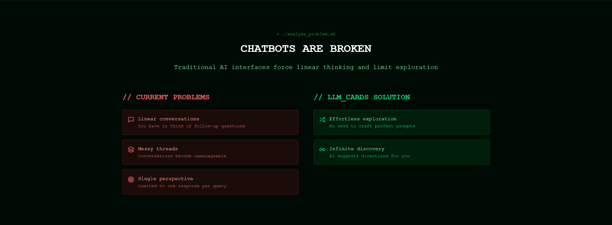

read# LLM Cards



## Swipe Interface for AI Interaction

LLM Cards is an open-source application that provides an intuitive swipe interface for AI interaction. Instead of linear conversations, you get instant access to multiple AI perspectives through simple gestures.

**Created by [@PanzerBread](https://x.com/PanzerBread) on X**

## What Does It Do?

- **🔄 Swipe Interface**: Swipe left for fast insights, swipe right for deep analysis
- **🧠 Multi-Model Intelligence**: Different AI models for different needs (Mistral-3B for speed, Grok-4 for depth)
- **🎯 Smart Caching**: Pre-generated detailed responses for instant access
- **🏷️ Dynamic Badges**: AI-generated topic suggestions for infinite exploration
- **⚡ Terminal Aesthetic**: Clean, focused interface inspired by developer terminals
- **🌙 Dark Mode Design**: Beautiful, modern UI optimized for dark themes

## How It Works

1. **Ask Once**: Type your question or idea into the interface
2. **Swipe to Explore**:
   - **Swipe Left** → Get fast insights from Mistral-3B
   - **Swipe Right** → Access deep analysis from Grok-4
3. **Tap Badges**: Discover related topics and explore infinitely
4. **Explore**: Navigate through related topics and perspectives

## Required Environment Variables

To run LLM Cards, you need these environment variables:

```bash
OPENROUTER_API_KEY=your_openrouter_api_key_here
```

- **OPENROUTER_API_KEY**: For accessing multiple AI models (Mistral-3B, Grok-4, etc.)

## Quick Start

1. **Clone the repository**:

   ```bash
   git clone https://github.com/KrzysztofStaron/llm-cards.git
   cd llm-cards
   ```

2. **Install dependencies**:

   ```bash
   pnpm install
   ```

3. **Set up environment variables**:
   Create a `.env.local` file in the root directory:

   ```bash
   OPENROUTER_API_KEY=your_openrouter_api_key_here
   ```

4. **Build and run**:

   ```bash
   pnpm build
   pnpm start
   ```

5. **Open your browser**:
   Navigate to `http://localhost:3000`

## Features

### 🔄 Swipe Interface

- **Left Swipe**: Fast insights using Mistral-3B for quick understanding
- **Right Swipe**: Deep analysis using Grok-4 for comprehensive exploration
- **Gesture-Based**: Intuitive touch and mouse interactions
- **Fast Response**: Pre-cached responses for quick access

### 🧠 Multi-Model Orchestra

- **Mistral-3B**: Optimized for speed and efficiency
- **Grok-4**: Designed for depth and comprehensive analysis
- **Smart Routing**: Automatic model selection based on user intent
- **Seamless Integration**: No visible model switching for users

### 🎯 Smart Caching System

- **Pre-Generated Responses**: Detailed analysis cached in background
- **Instant Access**: No waiting when you swipe right for deep insights
- **Cost Optimization**: Efficient API usage through intelligent caching
- **Performance Optimized**: Fast response times

### 🏷️ AI Navigation

- **Dynamic Badges**: Context-aware topic suggestions
- **Guided Exploration**: AI suggests related topics and directions
- **Related Topics**: Discover connections and new perspectives
- **Progressive Disclosure**: Start simple, go deep when needed

### 🛠️ Developer Features

- **Terminal Aesthetic**: Clean, distraction-free interface
- **Responsive Design**: Works perfectly on desktop and mobile
- **TypeScript**: Full type safety and modern development experience
- **Open Source**: Complete transparency and community contribution

## Technology Stack

- **Frontend**: Next.js 15, React 19, TypeScript
- **Styling**: Tailwind CSS, shadcn/ui components
- **AI Integration**: OpenRouter API (Mistral-3B, Grok-4, and more)
- **Package Manager**: pnpm
- **Deployment**: Vercel-ready configuration

## API Costs

- **Fast Responses**: ~$0.00015 per 1K tokens (Mistral-3B via OpenRouter)
- **Deep Analysis**: ~$0.0003 per 1K tokens (Grok-4 via OpenRouter)
- **Smart Caching**: Reduces costs by pre-generating responses
- **Development**: Optimized for minimal API calls during development

## Development vs Production

**Development Mode** (localhost):

- Local caching for faster development
- Debug tools available
- Console logging enabled
- Optimized for rapid iteration

**Production Mode**:

- Smart caching for optimal performance
- Debug tools hidden
- Optimized for user experience
- Cost-effective API usage

## The Problem We Solve

### ❌ Traditional Chatbot Limitations

- **Linear Conversations**: Requires thinking of follow-up questions
- **Thread Management**: Conversations become difficult to navigate
- **Single Response**: Limited to one response per query
- **Prompt Engineering**: Requires crafting specific prompts

### ✅ LLM Cards Approach

- **Guided Exploration**: AI suggests related topics and directions
- **Easy Discovery**: Multiple perspectives accessible through simple gestures
- **Multi-Model Access**: Different AI models for different needs
- **Progressive Disclosure**: Start simple, access depth when needed

## Contributing

LLM Cards is 100% open source and community-driven. We welcome contributions!

1. Fork the repository
2. Create your feature branch (`git checkout -b feature/amazing-feature`)
3. Commit your changes (`git commit -m 'Add some amazing feature'`)
4. Push to the branch (`git push origin feature/amazing-feature`)
5. Open a Pull Request

## License

This project is licensed under the MIT License - see the [LICENSE](LICENSE) file for details.

## Support

- **GitHub Issues**: Report bugs and request features
- **Community**: Join developers, AI enthusiasts, and creative minds
- **Creator**: Follow [@PanzerBread](https://x.com/PanzerBread) on X

---

**A modern approach to AI interaction through intuitive swipe gestures.**
